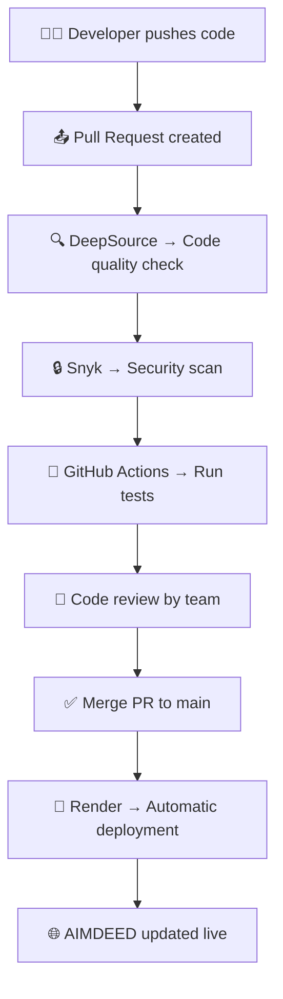

# Aimdeed - NEET & JEE Preparation Platform

Aimdeed is a comprehensive educational platform designed to help students prepare for NEET and JEE examinations. It provides premium study materials, mentorship programs, an AI chatbot for study assistances, and a JEE rank predictor.

## 🚀 Features
- **User Authentication**: Secure signup, login, and robust password reset functionality.
- **Role-based Access**: Protected routes for premium content, tools, and mentors.
- **AI Chatbot**: Integrated study assistant powered by OpenRouter/OpenAI.
- **Rank Predictor**: Data-driven JEE rank prediction using historical JOSAA data.
- **Payment Gateway**: Built-in UPI-based payment system for premium access.
- **Modern UI/UX**: Distinctive, stunning blue-theme interface featuring glassmorphism and smooth animations.

---

## 🛠️ Prerequisites

To run this project locally, ensure you have the following installed on your machine:
- **Node.js** (v18.x or v20.x recommended)
- **npm** (comes with Node.js)
- **MongoDB** (running locally on port 27017, or a MongoDB Atlas URI)
- **Docker & Docker Compose** (Optional, if you prefer running via containers)

---

## 💻 Local Setup Instructions

### 1. Clone the repository
```bash
git clone https://github.com/pijush008/Aimdeed.git
cd Aimdeed
```

### 2. Install Dependencies
```bash
npm install
```

### 3. Environment Variables Configuration
Create a `.env` file in the root directory of the project and define the required configuration variables. You can use the following template:

```env
# Server
PORT=3000
NODE_ENV=development

# Database
MONGO_URL=mongodb://127.0.0.1:27017/aimdeed
SESSION_SECRET=your_super_secret_session_key

# Email Details (For Password Reset / Contact Forms)
# Use a Gmail account with an "App Password"
EMAIL_USERNAME=your.email@gmail.com
EMAIL_PASSWORD=your_16_char_app_password

# Artificial Intelligence (Chatbot)
OPENROUTER_API_KEY=your_openrouter_api_key

# Payments
UPI_ID=your_merchant_upi_id@bank
```

### 4. Start MongoDB
Ensure that your MongoDB service is running locally on your computer.
```bash
# On Linux
sudo systemctl start mongod

# On macOS (using Homebrew)
brew services start mongodb-community
```

### 5. Start the Application
You can start the server using npm:
```bash
npm start
```
The application will be accessible at `http://localhost:3000`.

---

## 🐳 Docker Setup (Alternative)

If you do not want to configure Node.js and MongoDB natively on your machine, you can run the entire application stack using Docker.

1. Ensure **Docker Desktop** or the Docker Engine is running.
2. Ensure you have created the `.env` file in the root directory.
3. Build and spin up the containers:
```bash
docker-compose up --build
```
This automatically sets up the Node.js application and a MongoDB database, linking them together on a virtual network. The app will be heavily cached and bound to `http://localhost:3000`.

---

## 🤝 Contribution Guidelines
1. Fork the repository
2. Create a new branch (`git checkout -b feature/AmazingFeature`)
3. Commit your changes (`git commit -m 'Add some AmazingFeature'`)
4. Push to the branch (`git push origin feature/AmazingFeature`)
5. Open a Pull Request

## 🔄 Enterprise CI/CD Pipeline

This project follows a professional, multi-stage CI/CD pipeline that enforces code quality, security, and automated deployment on every Pull Request.



### Pipeline Tools

| Tool | Purpose | Trigger |
|------|---------|---------|
| **DeepSource** | Static code analysis, code quality | Every PR (via GitHub App) |
| **Snyk** | Dependency & security vulnerability scan | Every PR & push |
| **GitHub Actions** | Automated build + test (Node 18 & 20) | Every PR & push |
| **Code Review** | Human review before merge | Pull Request |
| **Render** | Automatic deployment via Docker | On merge to `main` |

### Setup Instructions

**Snyk (Security Scanning):**
1. Sign up at [snyk.io](https://snyk.io) with your GitHub account
2. Go to your GitHub repo → **Settings** → **Secrets and variables** → **Actions**
3. Add a secret named `SNYK_TOKEN` with your Snyk API token

**DeepSource (Code Quality):**
1. Sign up at [deepsource.com](https://deepsource.com) with GitHub
2. Add the Aimdeed repository — DeepSource will detect `.deepsource.toml` automatically
3. It will post quality reports directly on every Pull Request

**Render (Deployment):**
1. Connect your GitHub repo at [render.com](https://render.com)
2. Set environment to **Docker** — it will use the `Dockerfile` automatically
3. Every merge to `main` triggers an automatic redeploy

## 📝 License
Distributed under the ISC License.
